# ⚙️ Lezzet Atlası | Backend (ASP.NET Core Web API)

Bu depo, **Lezzet Atlası** online sipariş ve restoran yönetim platformunun sunucu tarafını barındırmaktadır. Modern RESTful mimari standartlarına uygun olarak **C#** ve **ASP.NET Core Web API** kullanılarak geliştirilmiştir.

---

## 🏗️ Mimari & Temel Özellikler

### 🔒 Güvenlik & Kimlik Doğrulama (JWT Auth)
- **JSON Web Tokens (JWT):** Güvenli ve durumsuz oturum yönetimi.
- **Yetkilendirme:** Role-Based Auth ile Müşteri ve Admin ayrımı.

### 🗄️ Veritabanı & ORM (EF Core)
- **Code-First:** C# modelleri üzerinden otomatik tablo yönetimi.
- **İlişkisel Tasarım:** Restoran, Ürün ve Sipariş arası veri bütünlüğü.

---

## 🧪 API Operasyonel Doğrulama Raporu (Full CRUD)

Sistemin tüm ana modülleri **Swagger UI** üzerinden test edilmiş ve operasyonel başarısı aşağıdaki görsellerle kayıt altına alınmıştır:

### 🔑 1. Kimlik Doğrulama (Auth)
- **Kullanıcı Kayıt:** 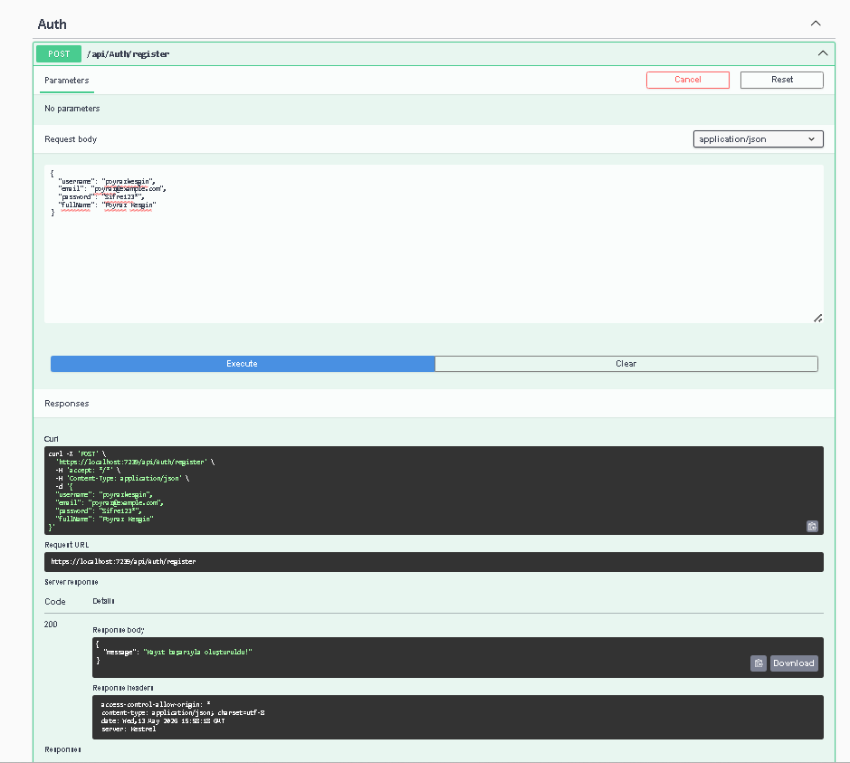
- **Giriş & Token Üretimi:** 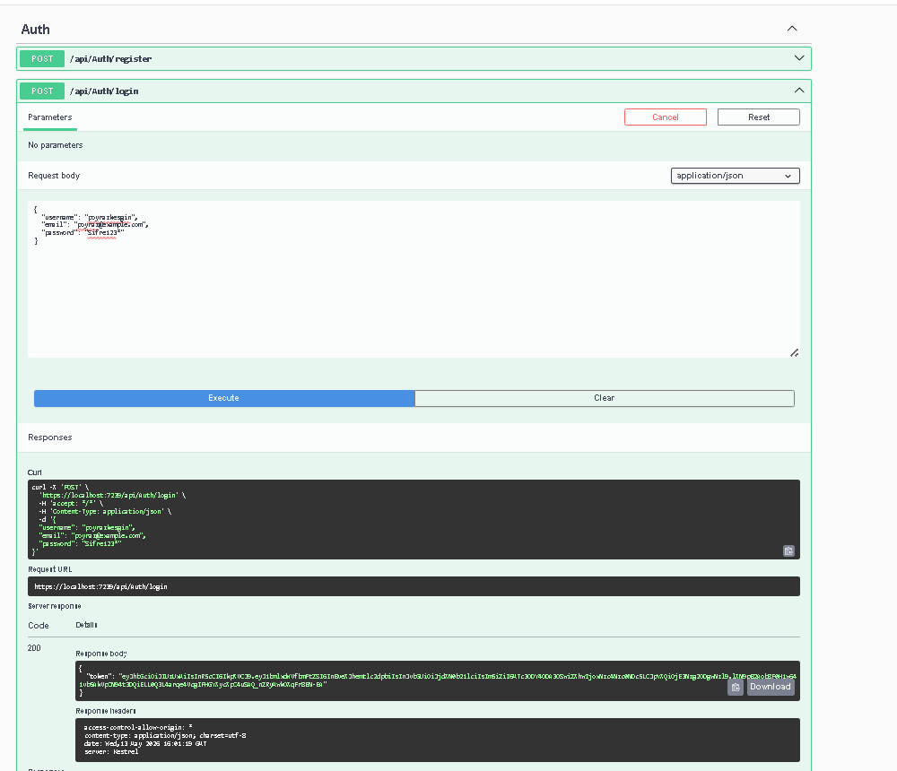

### 🏪 2. Restoran Yönetimi
- **Ekleme:** 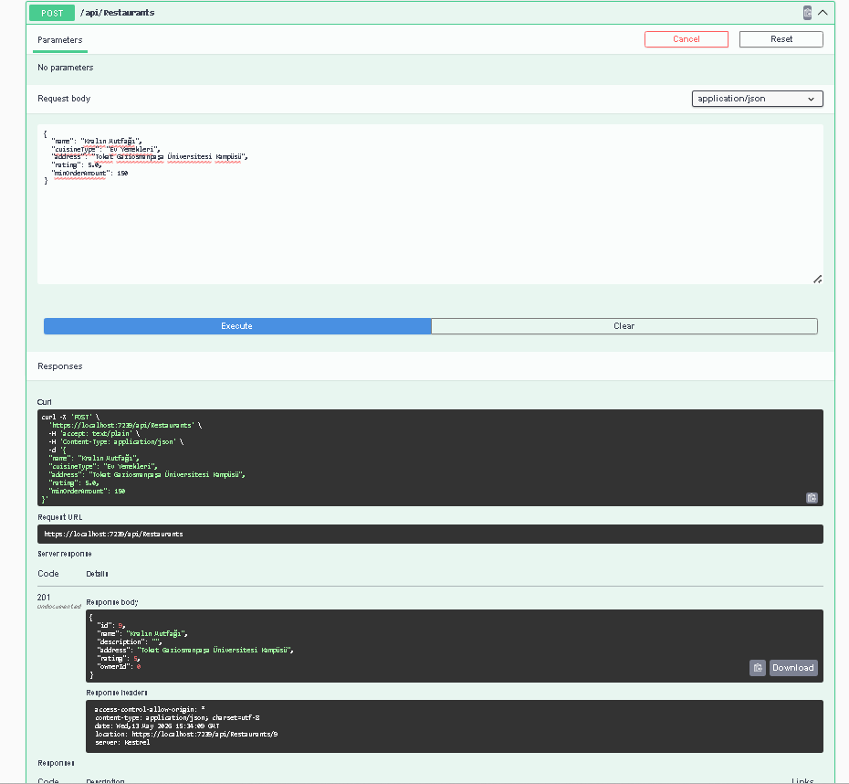 
- **Listeleme:** 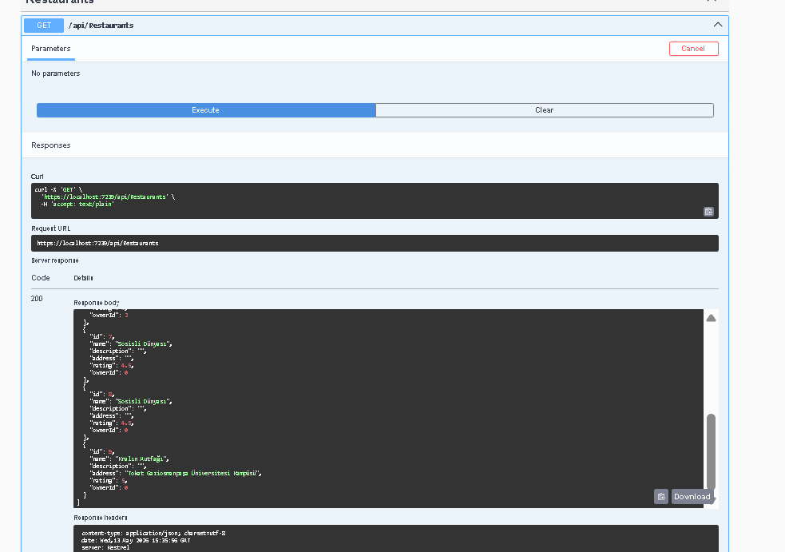
- **Güncelleme:** 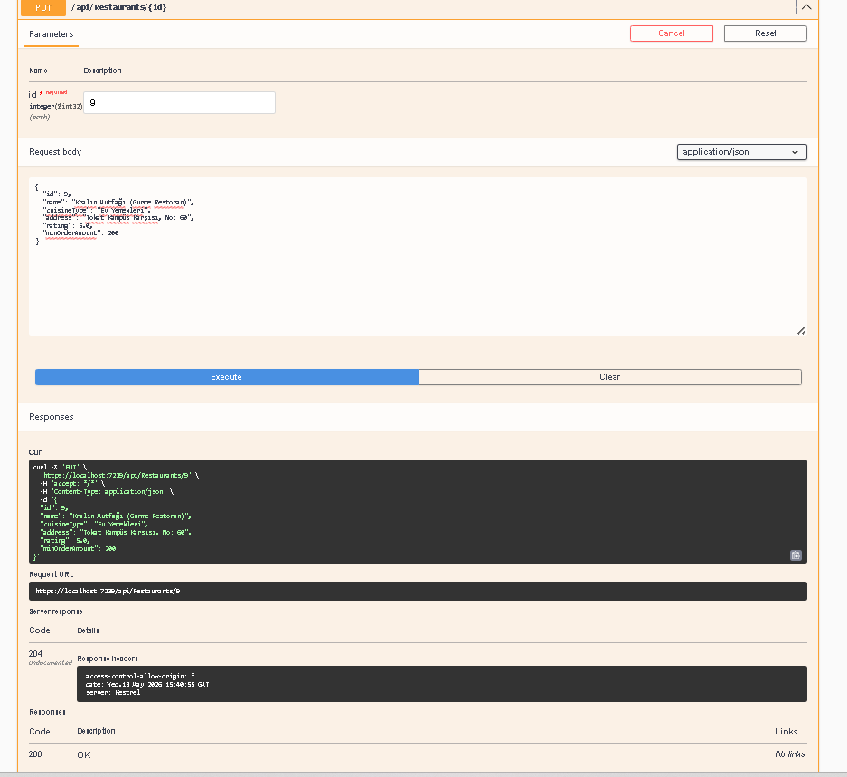 
- **Silme:** 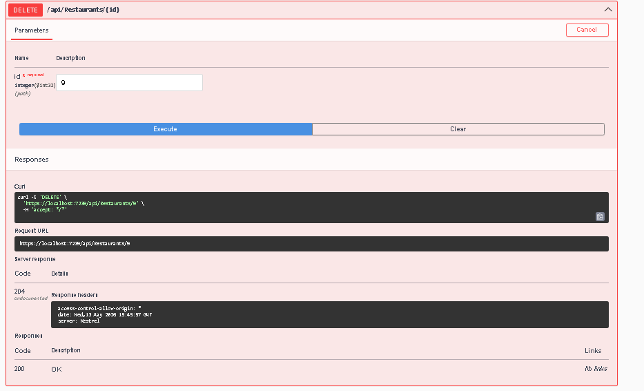

### 🌭 3. Ürün ve Menü Mimarisi
- **Ekleme:** 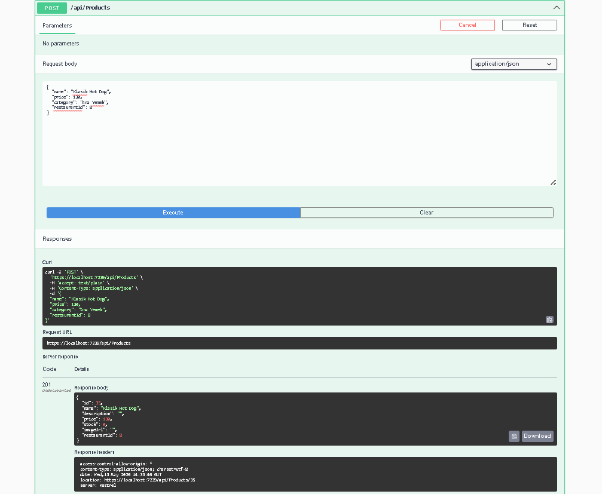 
- **Sorgulama:** 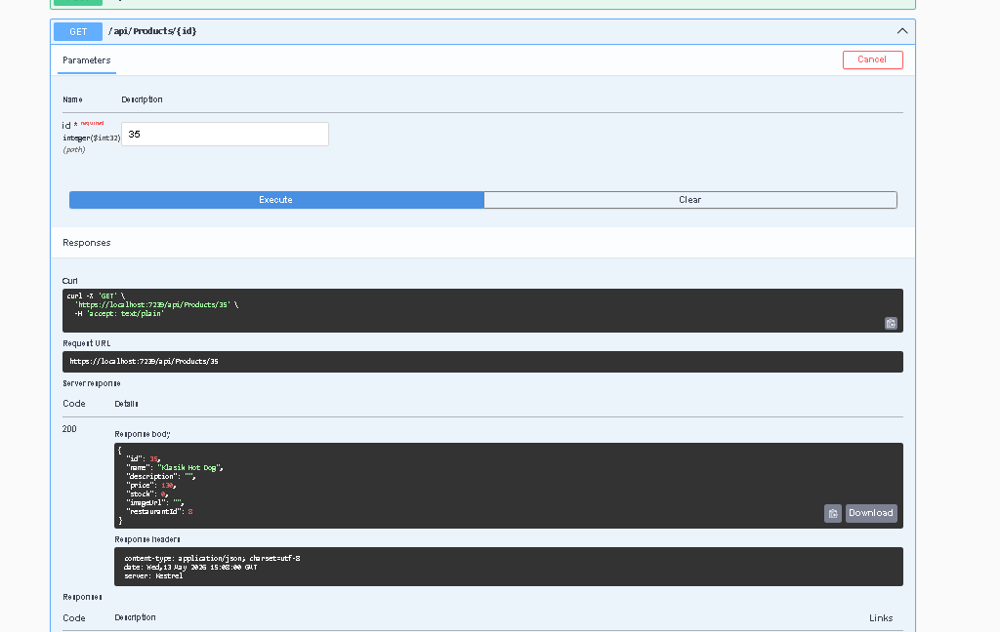
- **Güncelleme:** 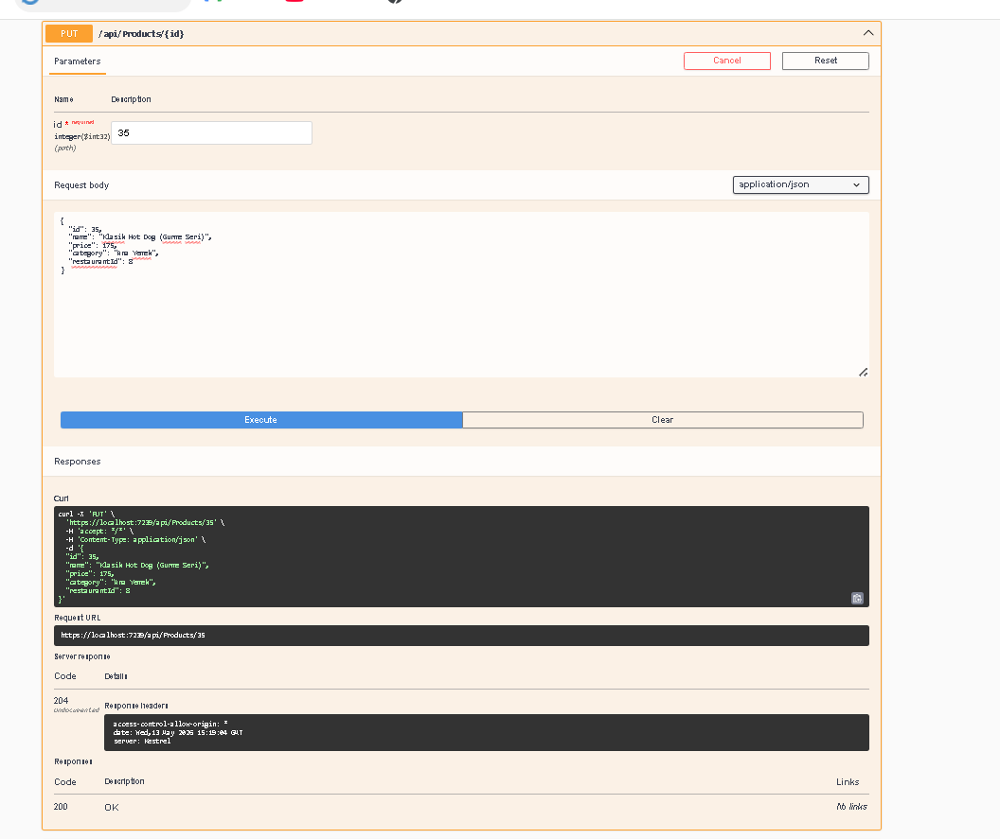 
- **Silme:** 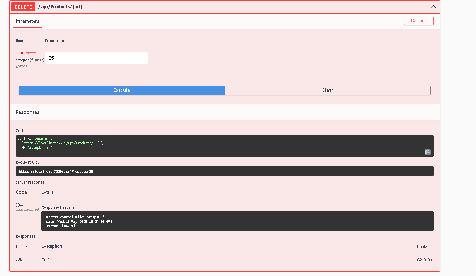

### 📦 4. Sipariş İşlem Motoru
- **Sipariş Oluşturma:** 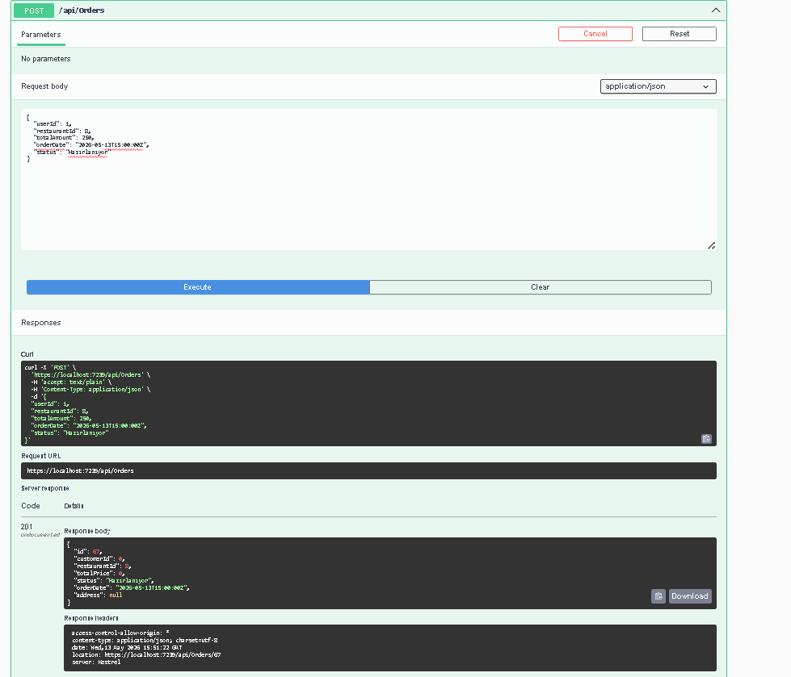
- **Sipariş Detayı (ID):** 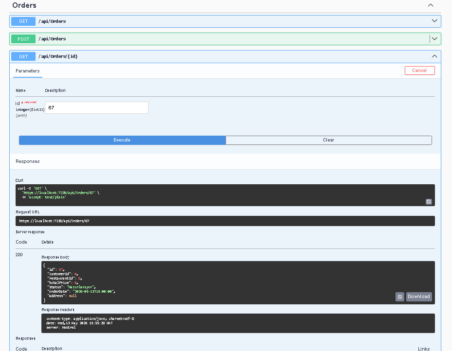
- **Sipariş Takibi:** 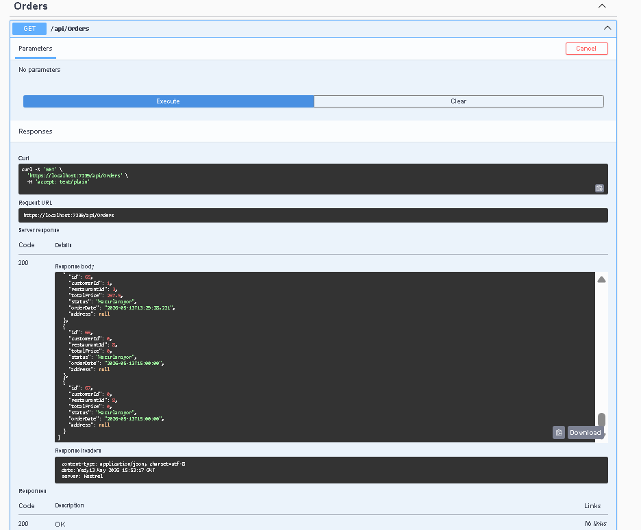

---

## 🛠️ Kullanılan Teknolojiler
- **Core:** .NET 8.0, C# 12
- **Data:** Entity Framework Core, SQLite
- **Security:** JWT Bearer
- **Docs:** Swagger (OpenAPI)

---

> **Geliştirici:** Poyraz Kesgin  
> **Durum:** API uçları başarıyla test edildi ve dökümante edildi.
